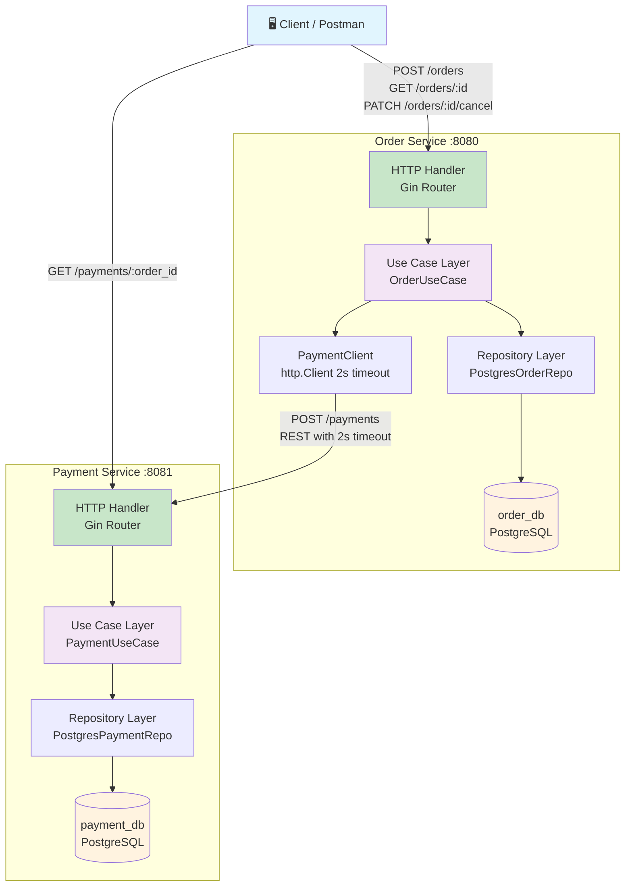

# AP2 Assignment 1 — Clean Architecture Microservices: Order & Payment

## 📋 Содержание

- [Обзор](#обзор)
- [Архитектурные решения](#архитектурные-решения)
- [Bounded Contexts](#bounded-contexts)
- [Архитектурная диаграмма](#архитектурная-диаграмма)
- [Структура проекта](#структура-проекта)
- [Как запустить](#как-запустить)
- [API Endpoints](#api-endpoints)
- [Failure Handling](#failure-handling)
- [Бонус: Idempotency](#бонус-idempotency)
- [Примеры curl](#примеры-curl)

---

## Обзор

Платформа состоит из **двух независимых микросервисов**, написанных на Go:

| Сервис | Порт | База данных | Ответственность |
|---|---|---|---|
| **Order Service** | 8080 | `order_db` (Postgres) | Управление заказами и их состоянием |
| **Payment Service** | 8081 | `payment_db` (Postgres) | Обработка платежей и проверка лимитов |

Сервисы общаются **исключительно через REST** (синхронно). Каждый сервис владеет **своей собственной базой данных** (Database-per-Service pattern).

---

## Архитектурные решения

### 1. Clean Architecture (внутри каждого сервиса)

Каждый сервис следует принципам Clean Architecture Роберта Мартина:

- **Domain Layer** — чистые сущности и доменные ошибки. Без зависимостей на фреймворки.
- **Use Case Layer** — вся бизнес-логика. Определяет Port-интерфейсы (Dependency Inversion).
- **Repository Layer** — имплементация Ports для Postgres через `database/sql`.
- **Transport/HTTP Layer** — тонкие хэндлеры Gin: парсинг → вызов use case → ответ.
- **App Layer** — Composition Root: ручная сборка зависимостей (Manual DI).

**Принцип зависимостей**: Domain ← UseCase ← Repository/Transport. Внутренние слои ничего не знают о внешних.

### 2. Финансовая точность

Все денежные суммы хранятся как `int64` (центы). Например, `15000 = $150.00`. Никакого `float64`.

### 3. Резилентность

- `http.Client` в Order Service имеет **Timeout = 2 секунды**.
- При недоступности Payment Service → Order получает статус `"Failed"`, клиент получает `503 Service Unavailable`.

### 4. Manual Dependency Injection

Все зависимости создаются и связываются в `main.go` (Composition Root). Никаких DI-фреймворков.

---

## Bounded Contexts

```
┌─────────────────────────┐     ┌─────────────────────────┐
│    ORDER CONTEXT         │     │   PAYMENT CONTEXT        │
│                         │     │                         │
│  Entities:              │     │  Entities:              │
│   - Order               │     │   - Payment             │
│                         │     │                         │
│  Responsibilities:      │     │  Responsibilities:      │
│   - Создание заказа     │     │   - Авторизация платежа │
│   - Отмена заказа       │     │   - Проверка лимита     │
│   - Хранение статуса    │     │   - Хранение транзакции │
│                         │     │                         │
│  Database: order_db     │     │  Database: payment_db   │
└────────────┬────────────┘     └────────────┬────────────┘
             │           REST /payments       │
             └───────────────────────────────►│
```

**Ключевые границы:**
- Order Service **не имеет доступа** к `payment_db`.
- Payment Service **не имеет доступа** к `order_db`.
- Нет общих пакетов, моделей или схем.

---

## Архитектурная диаграмма



---

## Структура проекта

```
project-root/
├── docker-compose.yml
├── README.md
│
├── order-service/
│   ├── Dockerfile
│   ├── go.mod
│   ├── go.sum
│   ├── cmd/
│   │   └── order-service/
│   │       └── main.go            # Composition Root (Manual DI)
│   ├── internal/
│   │   ├── domain/
│   │   │   ├── order.go           # Order entity + статусы
│   │   │   └── errors.go          # Доменные ошибки
│   │   ├── usecase/
│   │   │   ├── ports.go           # Интерфейсы (OrderRepository, PaymentGateway)
│   │   │   └── order_usecase.go   # Бизнес-логика заказов
│   │   ├── repository/
│   │   │   └── postgres_order.go  # Postgres имплементация OrderRepository
│   │   ├── transport/http/
│   │   │   ├── dto.go             # Request/Response DTOs
│   │   │   ├── handler.go         # Gin handlers (тонкие!)
│   │   │   └── router.go          # Router setup
│   │   └── app/
│   │       └── app.go             # Wiring helpers
│   ├── migrations/
│   │   └── 001_create_orders_up.sql
│   └── README.md
│
└── payment-service/
    ├── Dockerfile
    ├── go.mod
    ├── go.sum
    ├── cmd/
    │   └── payment-service/
    │       └── main.go
    ├── internal/
    │   ├── domain/
    │   │   ├── payment.go
    │   │   └── errors.go
    │   ├── usecase/
    │   │   ├── ports.go
    │   │   └── payment_usecase.go
    │   ├── repository/
    │   │   └── postgres_payment.go
    │   ├── transport/http/
    │   │   ├── dto.go
    │   │   ├── handler.go
    │   │   └── router.go
    │   └── app/
    │       └── app.go
    ├── migrations/
    │   └── 001_create_payments_up.sql
    └── README.md
```

---

## Как запустить

### Предварительные требования
- Docker & Docker Compose

### Запуск

```bash
# Клонировать/распаковать проект
cd project-root

# Запустить все (2 сервиса + 2 базы данных)
docker-compose up --build

# Проверить что сервисы запущены
curl http://localhost:8080/orders/test-id
curl http://localhost:8081/payments/test-id
```

### Остановка

```bash
docker-compose down -v   # -v удалит тома с данными
```

---

## API Endpoints

### Order Service (port 8080)

| Метод | Endpoint | Описание |
|---|---|---|
| `POST` | `/orders` | Создать заказ (+ вызов Payment Service) |
| `GET` | `/orders/:id` | Получить информацию о заказе |
| `PATCH` | `/orders/:id/cancel` | Отменить заказ (только `Pending`) |

### Payment Service (port 8081)

| Метод | Endpoint | Описание |
|---|---|---|
| `POST` | `/payments` | Авторизовать платёж |
| `GET` | `/payments/:order_id` | Получить платёж по order_id |

---

## Failure Handling

### Сценарий: Payment Service недоступен

1. Order Service создаёт заказ со статусом `"Pending"` в БД.
2. Order Service пытается вызвать `POST /payments` у Payment Service.
3. `http.Client` имеет **Timeout = 2 секунды**.
4. Если Payment Service не отвечает → timeout срабатывает.
5. Order Service обновляет заказ до статуса `"Failed"`.
6. Клиенту возвращается **503 Service Unavailable**.

**Почему "Failed", а не "Pending"?**

Мы выбрали `"Failed"` потому что:
- Заказ уже был отправлен на оплату — мы не можем гарантировать, что платёж не был обработан.
- Оставлять заказ в `"Pending"` может ввести в заблуждение: клиент подумает, что заказ ещё можно оплатить.
- `"Failed"` — явный сигнал клиенту о необходимости повторить попытку (создать новый заказ).
- С Idempotency-Key клиент может безопасно повторить тот же запрос.

### Сценарий: Сумма превышает лимит

1. Payment Service проверяет: `amount > 100000` → возвращает `"Declined"`.
2. Order Service обновляет заказ до `"Failed"`.

---

## Бонус: Idempotency

### Реализация

- Клиент отправляет заголовок `Idempotency-Key: <unique-uuid>` с запросом `POST /orders`.
- Order Service проверяет, есть ли заказ с таким ключом в базе данных.
- Если есть → возвращает существующий заказ (без создания дубликата).
- Если нет → создаёт новый заказ и сохраняет ключ.

### Таблица

```sql
-- Поле idempotency_key добавлено в таблицу orders с UNIQUE constraint
ALTER TABLE orders ADD COLUMN idempotency_key VARCHAR(255) UNIQUE;
```

### Пример

```bash
# Первый запрос — создаёт заказ
curl -X POST http://localhost:8080/orders \
  -H "Content-Type: application/json" \
  -H "Idempotency-Key: 550e8400-e29b-41d4-a716-446655440000" \
  -d '{"customer_id": "cust-1", "item_name": "Laptop", "amount": 15000}'

# Повторный запрос с тем же ключом — возвращает тот же заказ (без дубликата!)
curl -X POST http://localhost:8080/orders \
  -H "Content-Type: application/json" \
  -H "Idempotency-Key: 550e8400-e29b-41d4-a716-446655440000" \
  -d '{"customer_id": "cust-1", "item_name": "Laptop", "amount": 15000}'
```

---

## Примеры curl

### 1. Создать заказ (Happy Path)

```bash
curl -X POST http://localhost:8080/orders \
  -H "Content-Type: application/json" \
  -H "Idempotency-Key: $(uuidgen)" \
  -d '{
    "customer_id": "customer-001",
    "item_name": "MacBook Pro 16",
    "amount": 249900
  }'
```

**Ответ (201 Created):**
```json
{
  "id": "a1b2c3d4-...",
  "customer_id": "customer-001",
  "item_name": "MacBook Pro 16",
  "amount": 249900,
  "status": "Paid",
  "created_at": "2026-03-30T12:00:00Z"
}
```

### 2. Создать заказ с суммой > 100000 (Declined)

```bash
curl -X POST http://localhost:8080/orders \
  -H "Content-Type: application/json" \
  -d '{
    "customer_id": "customer-002",
    "item_name": "Luxury Car",
    "amount": 500000
  }'
```

**Ответ (422 Unprocessable Entity):**
```json
{
  "error": "payment declined: amount exceeds limit"
}
```

### 3. Получить заказ

```bash
curl http://localhost:8080/orders/a1b2c3d4-...
```

### 4. Отменить заказ (только Pending)

```bash
curl -X PATCH http://localhost:8080/orders/a1b2c3d4-.../cancel
```

### 5. Получить платёж по order_id

```bash
curl http://localhost:8081/payments/a1b2c3d4-...
```

### 6. Payment Service недоступен (остановите payment-service)

```bash
docker-compose stop payment-service

curl -X POST http://localhost:8080/orders \
  -H "Content-Type: application/json" \
  -d '{
    "customer_id": "customer-003",
    "item_name": "Test Item",
    "amount": 5000
  }'
```

**Ответ (503 Service Unavailable):**
```json
{
  "error": "payment service unavailable"
}
```

---

## Технологии

| Компонент | Технология |
|---|---|
| Язык | Go 1.22 |
| HTTP Framework | Gin |
| База данных | PostgreSQL 16 |
| DB Driver | lib/pq + database/sql |
| UUID | google/uuid |
| Контейнеризация | Docker + Docker Compose |

