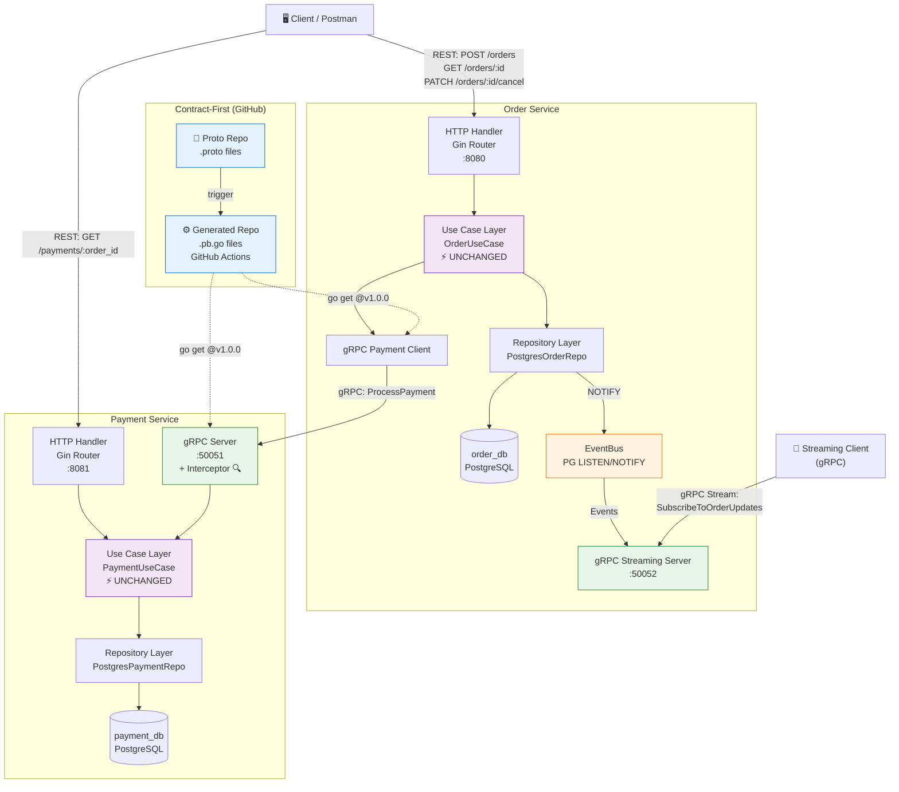

# AP2 Assignment 2 — gRPC Migration & Contract-First Development

**Student**: Taubakabyl Nurlybek  
**Course**: Advanced Programming 2  
**Scope**: Lecture 3 (Protocol Buffers) & Lecture 4 (gRPC)

---

## 📋 Repository Links

| Repository | URL |
|---|---|
| **Proto Repository** (`.proto` files only) | `https://github.com/YOUR_GITHUB_USER/ap2-proto` |
| **Generated Code Repository** (auto-generated `.pb.go`) | `https://github.com/YOUR_GITHUB_USER/ap2-proto-generated` |
| **Main Project Repository** | `https://github.com/YOUR_GITHUB_USER/ap2-assignment` |

---

## 🏗️ Architecture Overview

### What Changed from Assignment 1 → Assignment 2

| Component | Assignment 1 | Assignment 2 |
|---|---|---|
| Order ↔ Payment communication | REST (HTTP) | **gRPC** (Protocol Buffers) |
| Payment Service | HTTP Server only | HTTP Server + **gRPC Server** |
| Order Service | HTTP Server + HTTP Client | HTTP Server + **gRPC Client** + **gRPC Streaming Server** |
| Contract definition | N/A | **Contract-First** (.proto files) |
| Code generation | N/A | **GitHub Actions** (automated) |
| Real-time updates | N/A | **Server-side Streaming** (PostgreSQL LISTEN/NOTIFY) |

### What Did NOT Change (Clean Architecture Preserved ✅)

- **Domain Layer** (`internal/domain/`) — Zero changes
- **Use Case Layer** (`internal/usecase/`) — Zero changes
- **Ports/Interfaces** (`usecase/ports.go`) — Zero changes
- Only the **Delivery Layer** (transport/handlers) was updated

---

## 📐 Architecture Diagram



---

## 📁 Project Structure

```
project-root/
├── docker-compose.yml
├── .env.example
├── README.md
├── cmd/
│   └── streaming-client/
│       └── streaming_client.go        # Test client for streaming demo
│
├── order-service/
│   ├── Dockerfile
│   ├── go.mod / go.sum
│   ├── cmd/order-service/
│   │   └── main.go                    # UPDATED: starts REST + gRPC servers
│   ├── internal/
│   │   ├── domain/                    # ⚡ UNCHANGED from Assignment 1
│   │   │   ├── order.go
│   │   │   └── errors.go
│   │   ├── usecase/                   # ⚡ UNCHANGED from Assignment 1
│   │   │   ├── ports.go
│   │   │   └── order_usecase.go
│   │   ├── repository/
│   │   │   ├── postgres_order.go      # UPDATED: added NOTIFY on status change
│   │   │   └── event_bus.go           # NEW: PostgreSQL LISTEN/NOTIFY EventBus
│   │   ├── transport/
│   │   │   ├── http/                  # ⚡ UNCHANGED from Assignment 1
│   │   │   │   ├── dto.go
│   │   │   │   ├── handler.go
│   │   │   │   └── router.go
│   │   │   └── grpc/                  # NEW: gRPC streaming server
│   │   │       └── server.go
│   │   └── app/
│   │       ├── app.go                 # UPDATED: added gRPC config
│   │       └── payment_grpc_client.go # NEW: replaces REST PaymentClient
│   └── migrations/
│       └── 001_create_orders_up.sql
│
└── payment-service/
    ├── Dockerfile
    ├── go.mod / go.sum
    ├── cmd/payment-service/
    │   └── main.go                    # UPDATED: starts REST + gRPC servers
    ├── internal/
    │   ├── domain/                    # ⚡ UNCHANGED from Assignment 1
    │   │   ├── payment.go
    │   │   └── errors.go
    │   ├── usecase/                   # ⚡ UNCHANGED from Assignment 1
    │   │   ├── ports.go
    │   │   └── payment_usecase.go
    │   ├── repository/
    │   │   └── postgres_payment.go    # ⚡ UNCHANGED
    │   ├── transport/
    │   │   ├── http/                  # ⚡ UNCHANGED from Assignment 1
    │   │   │   ├── dto.go
    │   │   │   ├── handler.go
    │   │   │   └── router.go
    │   │   └── grpc/                  # NEW: gRPC server + interceptor
    │   │       ├── server.go
    │   │       └── interceptor.go     # BONUS: logging interceptor
    │   └── app/
    │       └── app.go                 # UPDATED: added GRPC_PORT config
    └── migrations/
        └── 001_create_payments_up.sql
```

---

## 🚀 How to Run

### Prerequisites
- Docker & Docker Compose
- Go 1.22+ (for streaming test client)

### 1. Start all services
```bash
cd project-root
docker-compose up --build
```

### 2. Test REST endpoints (same as Assignment 1)
```bash
# Create order (Happy Path)
curl -X POST http://localhost:8080/orders \
  -H "Content-Type: application/json" \
  -d '{"customer_id": "cust-1", "item_name": "Laptop", "amount": 15000}'

# Get order
curl http://localhost:8080/orders/<ORDER_ID>

# Cancel order
curl -X PATCH http://localhost:8080/orders/<ORDER_ID>/cancel

# Get payment
curl http://localhost:8081/payments/<ORDER_ID>
```

### 3. Test Streaming (Server-side Streaming RPC)

**Terminal 1** — Start streaming client:
```bash
cd project-root
go run cmd/streaming-client/streaming_client.go <ORDER_ID>
```

**Terminal 2** — Change order status:
```bash
# Cancel the order → streaming client immediately receives the update!
curl -X PATCH http://localhost:8080/orders/<ORDER_ID>/cancel
```

### 4. Verify gRPC Interceptor (Bonus)
Check Payment Service logs:
```bash
docker logs payment-service 2>&1 | grep "gRPC INTERCEPTOR"
```
You'll see:
```
[gRPC INTERCEPTOR] method=/payment.PaymentService/ProcessPayment duration=1.234ms status=OK
```

---

## 🔧 Contract-First Flow

```
1. Edit .proto files in Proto Repo
2. Push to GitHub
3. GitHub Actions in Generated Repo runs protoc
4. Generated .pb.go files are committed with a tag (v1.0.0)
5. Services use: go get github.com/YOUR_GITHUB_USER/ap2-proto-generated@v1.0.0
```

---

## 📝 gRPC Service Definitions

### PaymentService (payment.proto)
```protobuf
service PaymentService {
  rpc ProcessPayment(PaymentRequest) returns (PaymentResponse);
}
```

### OrderService (order.proto)
```protobuf
service OrderService {
  rpc SubscribeToOrderUpdates(OrderRequest) returns (stream OrderStatusUpdate);
}
```

## 🔄 Shutdown
```bash
docker-compose down -v
```
