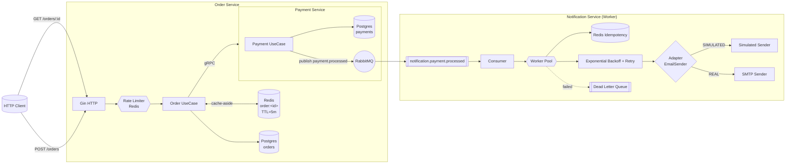

# AP2 — Microservices Platform (Assignment 4)

**Student**: Rassul Tokatov 
**Course**: Advanced Programming 2  
**Assignment**: 4 — Performance Optimization & External Integrations  
**Scope**: Lecture 7 (Caching) + Lectures 8-9 (Background Jobs & External APIs)  
**Deadline**: 12.05.2026

---

## 🎯 Реализованные требования

- **Redis Cache-aside** в Order Service с правильной инвалидацией
- **Background Worker** в Notification Service (асинхронная обработка уведомлений)
- **Adapter Pattern** для внешних провайдеров уведомлений
- **Idempotency** через Redis
- **Exponential Backoff + Retry** механизм
- **Rate Limiter** (Bonus) на Redis
- Полная Docker-инфраструктура + Redis

---

## 🏗️ Архитектура



---

## 🚀 Как запустить проект

```bash
docker compose up --build
```

**Доступные сервисы:**

| Сервис             | Адрес                          | Примечание                     |
|--------------------|--------------------------------|--------------------------------|
| Order Service      | http://localhost:8080          | Основной API                   |
| Payment Service    | http://localhost:8081          | —                              |
| RabbitMQ UI        | http://localhost:15672         | guest / guest                  |
| Redis              | localhost:6379                 | —                              |

---

## 🔑 Ключевые технические решения

### 1. Caching в Order Service
- **Паттерн**: Cache-Aside
- **TTL**: 5 минут (`CACHE_TTL_SECONDS`)
- **Инвалидация**: Атомарная (`DEL`) после каждого изменения статуса заказа (`UpdateStatus`, оплата, отмена)
- При `GET /orders/:id` сначала проверяется Redis, потом БД

### 2. Notification Service — Background Worker
- Уведомления полностью вынесены из HTTP-пути в асинхронный worker
- Worker Pool с настраиваемым количеством горутин
- Manual ACK + DLQ для надёжности

### 3. Adapter Pattern
- Интерфейс `EmailSender`
- Две реализации:
    - `SimulatedSender` — имитирует задержку и случайные ошибки (для тестирования retry)
    - `SMTPSender` — реальная отправка через SMTP
- Переключение: `PROVIDER_MODE=SIMULATED|REAL`

### 4. Idempotency & Retries
- Идемпотентность через Redis `SETNX`
- Exponential Backoff с jitter
- После исчерпания попыток — сообщение уходит в DLQ

### 5. Rate Limiter (Bonus)
- Fixed Window алгоритм на Redis
- Лимит: 10 запросов в минуту (настраивается)
- Поддержка заголовка `X-User-Id`

---

## 📁 Основные изменения Assignment 4

- `order-service/internal/cache/` — слой кэширования
- `order-service/internal/transport/http/middleware/rate_limiter.go` — Rate Limiter
- `notification-service/internal/provider/` — Adapter Pattern
- `notification-service/internal/service/` — Worker + Idempotency
- `notification-service/internal/retry/backoff.go` — Retry Policy
- Обновлён `docker-compose.yml` + Redis

---

## 🧪 Как тестировать (для защиты)

1. **Cache Hit/Miss**: Создать заказ → оплатить → проверить логи (`CACHE HIT` / `CACHE MISS`)
2. **Invalidation**: Изменить статус заказа → следующий `GET` должен вернуть актуальные данные
3. **Retry**: `PROVIDER_MODE=SIMULATED` → смотреть backoff в логах
4. **Idempotency**: Отправить одно и то же событие несколько раз — письмо должно отправиться только один раз
5. **Rate Limiter**: Отправить 15+ запросов подряд → должен вернуться `429 Too Many Requests`

---

## 📌 Статус выполнения

- [x] Redis Cache-aside + Invalidation
- [x] Background Jobs + Worker Pool
- [x] Adapter Pattern + Provider switching
- [x] Idempotency (Redis SETNX)
- [x] Exponential Backoff + Retry
- [x] Rate Limiter (Bonus)
- [x] Полная Docker-инфраструктура

**Готов к защите.**

---

Скопируй этот текст в файл `README.md`.

Хочешь более короткую версию или добавить что-то конкретное (например, скриншоты или дополнительные тесты) — скажи.